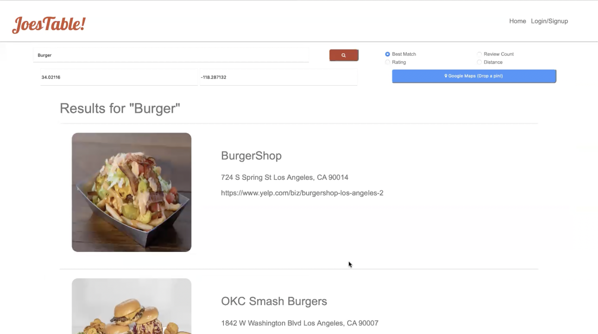
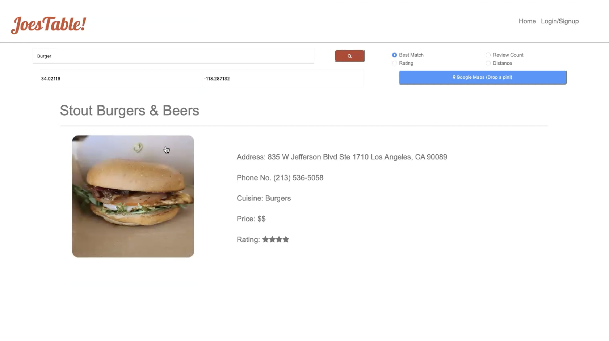
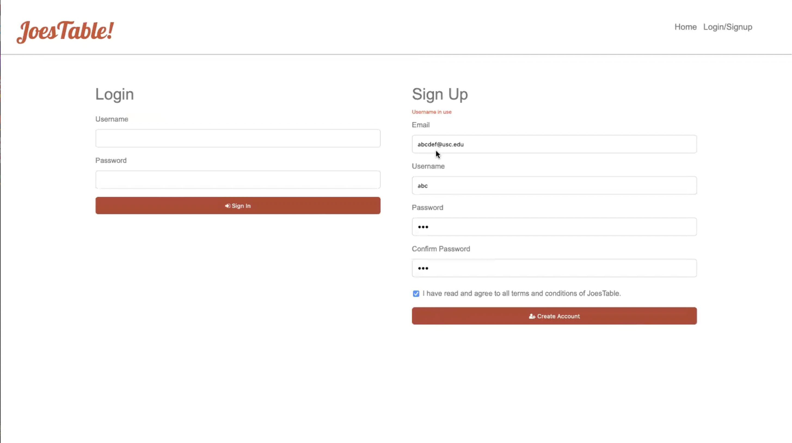
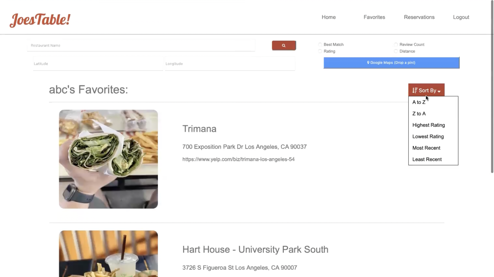
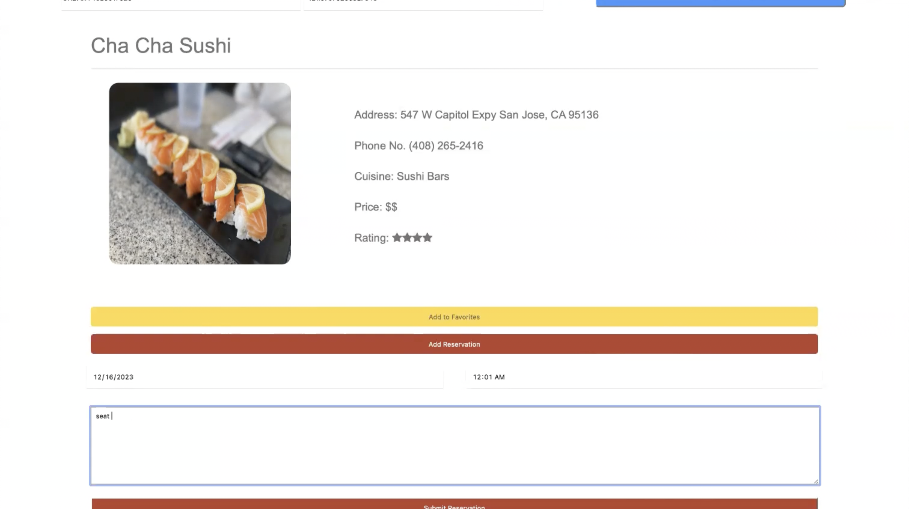
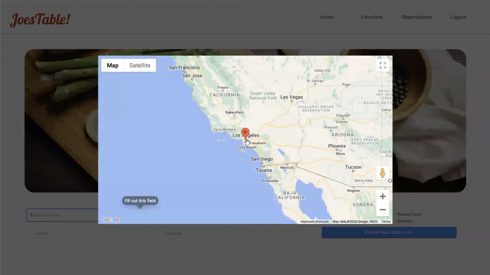

<h1>Restaurant Review Web App</h1>
The program allows users to search for restaurants, add them to their list of favorite restaurants, and schedule reservations for these restaurants. I implemented a database to keep track of user information and used a variety of different APIs.

Video of the Demo can be found here: https://youtu.be/jMi_oj3Qsss 

<h3>Description</h3>

•	Independent software engineering class project utilizing HTML, CSS, JavaScript, Java, and SQL run on Apache Tomcat.

•	Added functionality for log-in/sign-up, searching restaurants, adding to favorites, and creating reservations with JDBC API to read and modify tables in SQL database through Java functions. 

•	Loaded information from backend functions using AJAX and Java servlets and implemented restaurant search using API requests to Yelp Fusion API and Google Maps API.

•	Tools used: Apache Tomcat, MySQL, JDBC API, Yelp Fusion API, Google Maps API.
<h3>Demo Images</h3>

